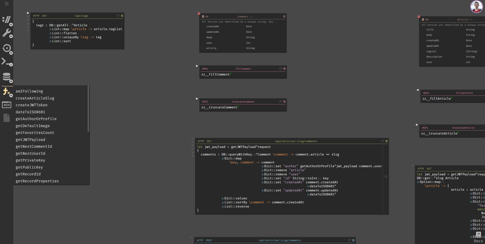

# Seed RealWorld with Dark lang

[**LIVE DEMO**: seed-realworld-darklang.netlify.com](https://seed-realworld-darklang.netlify.com/)

This repo contains two [RealWorld](https://github.com/gothinkster/realworld) examples:

# 
  
  - [Seed](https://seed-rs.org/) **frontend** is based on [seed-rs-realworld](https://github.com/seed-rs/seed-rs-realworld) and  [seed-quickstart-webpack](https://github.com/seed-rs/seed-quickstart-webpack).
    - The code is clean enough, complete and there are some unit tests.
    - If you want to test it on your local machine, follow instructions in the [quickstart's readme](https://github.com/seed-rs/seed-quickstart-webpack).
    - Architecture is described in the original [realworld readme](https://github.com/seed-rs/seed-rs-realworld).
    - Do you have any questions? Join our forum and chat - links on the [Seed's website](https://seed-rs.org/).
    - I want to reduce some boilerplate in the future and update it together with Seed.

# 
  
  - **Backend** is written in [Dark lang](https://darklang.com/).
    - It's a full implementation of RealWorld specs, tested manually and with the official RealWorld Postman collection.
    - I tried to apply _Trace Driven Development_ - it works very well with Seed/Rust frontend.
    - It contains 19 HTTP endpoints with JWT auth, 6 Datastores and some REPLs and Functions.
    - If you want to try Dark lang, [join](https://darklang.com/) their private beta testing. Mention my username `martinkavik` to get invitation faster.
    - When you find bugs or have questions, create an issue in this repo.
    - It's not possible to share code at the moment so you can see at least a part of the canvas below. 

# 
